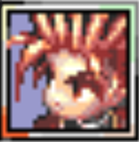
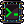

<h1 align="center">
  
  
   Hi, I’m Victor Leta! 
  
<h4 align="center">
    
  
      
  

##  Computer Science undergrad - UFRRJ 🇧🇷
##  Front-End Development!

##  I’m currently looking for internship opportunities!   

<!---
victorrlo/victorrlo is a ✨ special ✨ repository because its `README.md` (this file) appears on your GitHub profile.
You can click the Preview link to take a look at your changes.
--->
